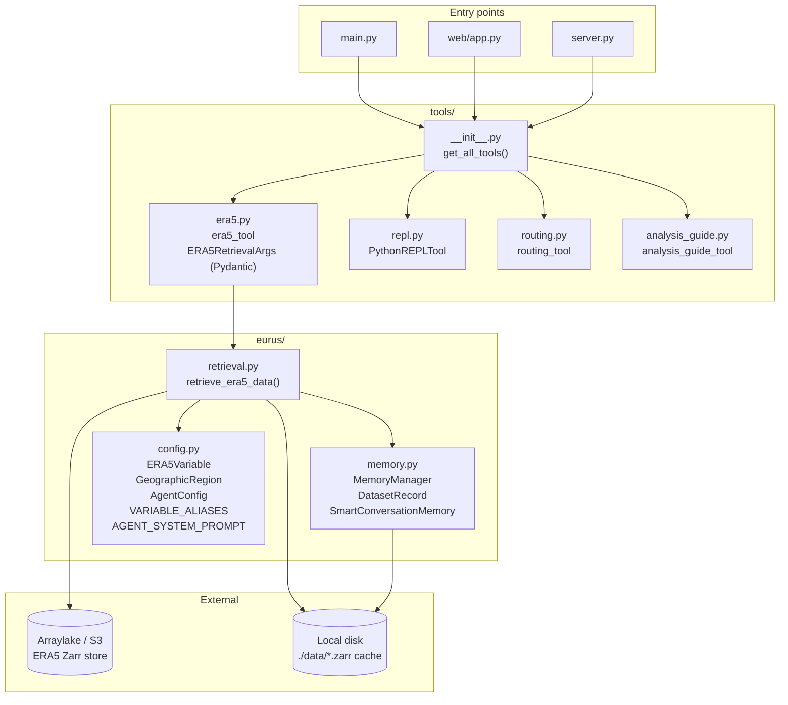
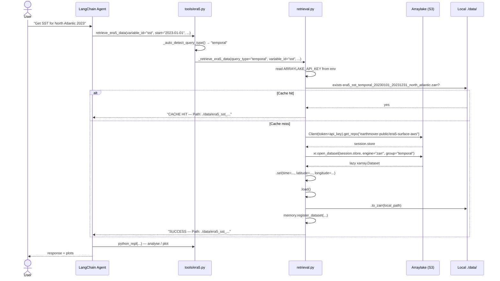
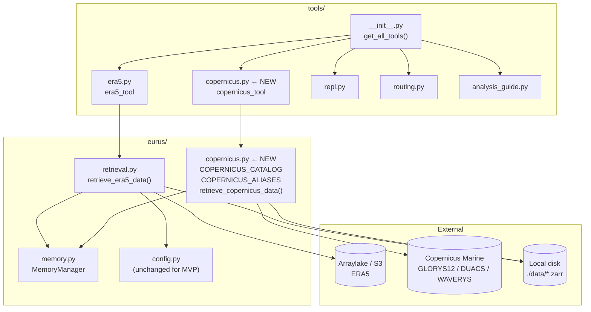

# Copernicus Marine Backend — Refined Plan (v2)

MVP focus. **Replace ERA5 with Copernicus for now.** ERA5 files stay untouched but unwired.
Multi-backend routing is the next step after this works.

---

## Current architecture (ERA5)

### Module map



### Variable alias wiring (ERA5)

`config.py` holds two structures:

- **`ERA5_VARIABLES`** — `dict[short_name → ERA5Variable]`
  Canonical catalog. `ERA5Variable` carries `short_name`, `long_name`, `units`, `description`, `category`, `typical_range`, `colormap`.

- **`VARIABLE_ALIASES`** — `dict[friendly_name → short_name]`
  e.g. `"sea_surface_temperature" → "sst"`, `"temperature" → "t2"`.

`get_short_name(variable_id)` checks aliases first, then falls back to the main dict, then returns the input as-is.
The Pydantic validator in `tools/era5.py` calls `get_short_name()` to normalise before the tool runs.
The LLM itself never needs to know about aliases — the system prompt lists short names; the validator is just a safety net.

### Sequence: user prompt → cached Zarr



Key points:
- **Credentials**: `ARRAYLAKE_API_KEY` read from env (checked explicitly; returns error string if missing)
- **No query_type exposed to LLM** — auto-detected from time span × area
- **Cache key** = deterministic filename from variable + dates + bounds; checked before any network call
- **Return type**: always a plain string (success or error); no exceptions bubble up

---

## Where Copernicus slots in

### Decision: flat file, not `backends/` subpackage

ERA5 lives at `eurus/retrieval.py`. Copernicus should live at `eurus/copernicus.py` — same level, same pattern. A `backends/` subpackage adds indirection with no MVP benefit; can be refactored later if a third backend appears.

### Updated module map (after adding Copernicus)



---

## Concrete decisions (from feedback)

| Topic | Decision |
|---|---|
| Credentials | Assume `copernicusmarine login` already run → `~/.copernicusmarine` exists. No env-var check, no helpful error. Just let the toolbox fail naturally. |
| `service=` kwarg | Auto-detected: `arco-time-series` when time>1d AND area<900sq°, else `arco-geo-series` (mirrors ERA5 temporal/spatial logic) |
| Variable aliases | Local `COPERNICUS_ALIASES` dict inside `eurus/copernicus.py`; not mixed into `config.py` |
| Depth/`my` vs `myint` | MVP: hardcode `my` dataset IDs only. `myint` fallback deferred. |
| System prompt | Add a minimal Copernicus section to `AGENT_SYSTEM_PROMPT` in `config.py` before first test session |
| `backends/` subpackage | No. Flat file: `eurus/copernicus.py` + `tools/copernicus.py` |

---

## Depth handling

Only four GLORYS12 variables have a depth dimension: `thetao`, `so`, `uo`, `vo`.
The tool exposes `depth_m: Optional[float] = None` (defaults to surface ≈ 0.5 m).

The LLM learns the mapping from the **tool description string** and the **system prompt**:

```
depth_m: depth in metres (default None = surface, ~0.5 m).
For bottom temperature use variable='bottomT' (no depth_m needed).
For mixed-layer depth use variable='mlotst'.
To average over the mixed layer: first retrieve mlotst, then retrieve
thetao with depth_m spanning 0→mld and compute the mean in python_repl.
```

So "surface temperature" → `thetao`, `depth_m=None`
"bottom temperature" → `bottomT`, `depth_m` ignored
"mixed-layer salinity" → agent retrieves `mlotst` first, then `so`, averages in REPL

---

## Catalog (MVP)

```python
@dataclass(frozen=True)
class CopernicusVariable:
    dataset_id: str
    var_name: str          # internal name in the CMEMS dataset
    long_name: str
    units: str
    has_depth: bool = False
```

| key | dataset_id | var_name | has_depth | long_name |
|---|---|---|---|---|
| `thetao` | `cmems_mod_glo_phy_my_0.083deg_P1D-m` | `thetao` | yes | Sea water potential temperature |
| `so` | same | `so` | yes | Sea water salinity |
| `uo` | same | `uo` | yes | Eastward sea water velocity |
| `vo` | same | `vo` | yes | Northward sea water velocity |
| `zos` | same | `zos` | no | Sea surface height above geoid |
| `mlotst` | same | `mlotst` | no | Mixed layer depth (sigma-theta) |
| `siconc` | same | `siconc` | no | Sea ice area fraction |
| `sithick` | same | `sithick` | no | Sea ice thickness |
| `bottomT` | same | `bottomT` | no | Sea floor potential temperature |
| `sla` | `cmems_obs-sl_glo_phy-ssh_my_allsat-l4-duacs-0.25deg_P1D` | `sla` | no | Sea level anomaly |
| `adt` | same | `adt` | no | Absolute dynamic topography |
| `ugos` | same | `ugos` | no | Geostrophic eastward velocity |
| `vgos` | same | `vgos` | no | Geostrophic northward velocity |
| `VHM0` | `cmems_mod_glo_wav_my_0.2deg_PT3H-i` | `VHM0` | no | Significant wave height |
| `VMDR` | same | `VMDR` | no | Mean wave direction |
| `VTM10` | same | `VTM10` | no | Mean wave period |

Aliases in `COPERNICUS_ALIASES` (local to `eurus/copernicus.py`):
`"temperature" → "thetao"`, `"salinity" → "so"`, `"sea_level" → "zos"`,
`"wave_height" → "VHM0"`, `"mld" → "mlotst"`, `"sea_ice" → "siconc"`, etc.

---

## Files to create / modify

### New (create)

**`src/eurus/copernicus.py`**
- `CopernicusVariable` dataclass, `COPERNICUS_CATALOG`, `COPERNICUS_ALIASES`
- `generate_filename()` → `cmems_{var}_{start}_{end}_{region_tag}.zarr`
- `retrieve_copernicus_data(variable_id, start_date, end_date, min/max lat/lon, depth_m, region)` → `str`
  - Resolve alias → catalog lookup → `dataset_id`, `var_name`, `has_depth`
  - Cache check (same pattern as `retrieval.py`)
  - `cm.open_dataset(dataset_id=..., variables=[var_name], ..., service="arco")`
  - If `has_depth`: pass `minimum_depth=depth_m or 0.5, maximum_depth=depth_m or 0.5`
  - `.load()`, size guard, `.to_zarr()`, `memory.register_dataset()`, return success string
  - No explicit credential check — let toolbox fail naturally

**`src/eurus/tools/copernicus.py`**
- `CopernicusRetrievalArgs` Pydantic schema
- Thin wrapper → `retrieve_copernicus_data`
- `copernicus_tool = StructuredTool.from_function(...)`

### Modified

**`src/eurus/tools/__init__.py`**
- Replace `era5_tool` import with `copernicus_tool`; swap in `get_all_tools()`
- ERA5 import left commented out for easy revert

**`src/eurus/config.py`**
- Replace ERA5 variable table in `AGENT_SYSTEM_PROMPT` with Copernicus variables + depth_m semantics
- Keep everything else (regions, style rules, etc.) unchanged

**`pyproject.toml`**
- `[project.optional-dependencies]` → `copernicus = ["copernicusmarine>=1.0.0"]`

### Untouched (kept, just unwired)

`src/eurus/retrieval.py`, `src/eurus/tools/era5.py`
